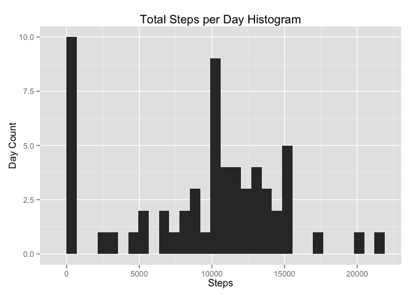
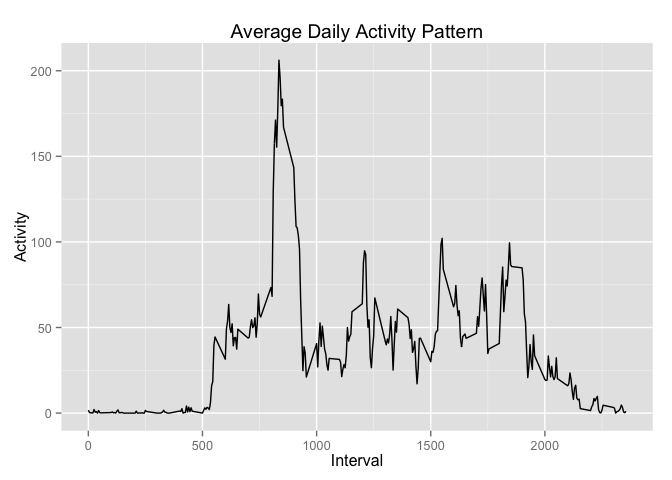
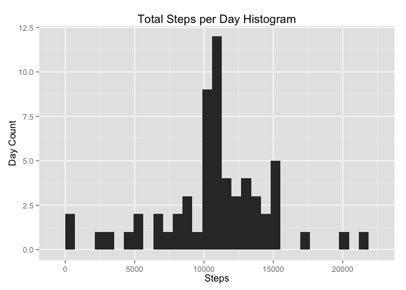
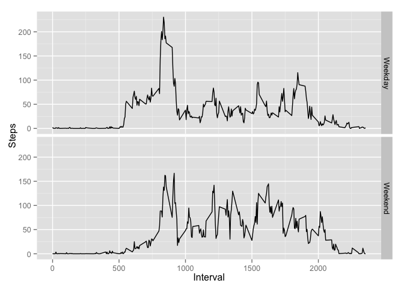

# Reproducible Research: Peer Assessment 1
Thiago Akio Nakamura  


## Loading and preprocessing the data
As the data is in a `comma separated value` file, it can be directly read via the `read.csv` command. For now, no further pre-processing is needed.


```r
data <- read.csv("activity.csv")
```


## What is mean total number of steps taken per day?
Through the command `tapply` we can sum the steps of each interval within a day, to obtain the total steps per day and visualize to result through a histogram.


```r
total.steps.day <- tapply(data$steps, data$date, sum, na.rm = TRUE)
qplot(total.steps.day, geom = "histogram",
      xlab = "Steps", ylab = "Day Count", 
      main = "Total Steps per Day Histogram")
```

 

The mean and median total steps per day are:

```r
mean(total.steps.day)
```

```
## [1] 9354.23
```

```r
median(total.steps.day)
```

```
## [1] 10395
```


## What is the average daily activity pattern?
Ainda using the `tapply` command, we can compute the average activity within each interval for all days in the data. The result can ve seen in the following time series plot.


```r
daily.activity <- tapply(data$steps, as.factor(data$interval), mean, na.rm = TRUE)
df <- data.frame(Interval = as.numeric(names(daily.activity)), Activity = daily.activity)
ggplot(data=df, 
       aes(x=Interval, y=Activity, group=1)) +
    geom_line() + labs(title = "Average Daily Activity Pattern")
```

 


## Imputing missing values
The amount of missing rows is:

```r
dim(data)[1] - sum(complete.cases(data))
```

```
## [1] 2304
```

To fill up the missing value, we will use the data in `daily.activity` we the average number of steps for the given missing interval.


```r
na.idxs <- is.na(data$steps)         # Find missing values
na.interval <- data$interval[na.idxs]     # Find associated interval
fill.values <- daily.activity[c(as.character(na.interval))]  # Find the average for the given interval

new.data <- data   # New data frame
new.data$steps[na.idxs] <- fill.values   # Fill NAs values
```

The new mean and median can be computed as follows, along with the new histogram for the daily activity.


```r
new.total.steps.day <- tapply(new.data$steps, data$date, sum, na.rm = TRUE)
mean(new.total.steps.day)
```

```
## [1] 10766.19
```

```r
median(new.total.steps.day)
```

```
## [1] 10766.19
```

```r
qplot(new.total.steps.day, geom = "histogram",
      xlab = "Steps", ylab = "Day Count", 
      main = "Total Steps per Day Histogram")
```

 

## Are there differences in activity patterns between weekdays and weekends?
To check if there are differences in the actitivy pattern between weekdays and weekends, we should separate the data with a new factor.

```r
new.factor <- as.POSIXlt(as.character(data$date), format= "%Y-%m-%d") # Change to POSIXlt class
new.factor <- weekdays(new.factor) # Obtain the weekday
weekend.idxs <- which(new.factor == "Saturday" | new.factor == "Sunday") # Find weekends day
new.factor[weekend.idxs] <- "Weekend" # Fill with Weekend values
new.factor[-weekend.idxs] <- "Weekday" # Fill with Weekday values
new.data$weekday <- as.factor(as.factor(new.factor)) # Create new factor
```

To check the difference in the activity patterns between weekdays and weekends, the following plane plot has been drawn.


```r
factor.list <- as.list(new.data[, c("interval", "weekday")]) # Create list with two factors
# Compute the mean for each combination of interval and weekday
separate.daily.activity <- data.frame(tapply(new.data$steps, factor.list, mean)) 
separate.daily.activity$Interval <- as.numeric(names(daily.activity)) 
# Melt data for plotting
separate.daily.activity <- melt(separate.daily.activity, id = "Interval", value.name = "Steps")
qplot(Interval, Steps,
      data = separate.daily.activity, 
      facets = variable ~ .,
      geom = "line")
```

 
